# A Three-Gate Validation Framework for Robust AI@Edge Development

This repository demonstrates the practical implementation of the **Three-Gate Validation Framework**, a systematic methodology for developing and deploying robust artificial intelligence on edge devices (AI@Edge). The framework introduces a structured process of three distinct validation gates—**Model, Hardware, and System**—designed to enforce rigorous testing and de-risk the transition from algorithm design to embedded implementation.

> **Learn more:** The academic paper detailing the framework's design, theory, and validation is available here: [Link to Open Access Paper will be added upon publication].

This repository is a fork (clone and extension) of the original [`HimaxWiseEyePlus/Seeed_Grove_Vision_AI_Module_V2`](https://github.com/HimaxWiseEyePlus/Seeed_Grove_Vision_AI_Module_V2) base repository. We extend our thanks to the original authors for their excellent work and foundation.

## Our Key Extension: The AFib Detection Testbench

The primary contribution of this fork is the **`af_detect_testbench`**, a comprehensive case study that applies the Three-Gate Validation Framework to the development of a clinical-grade Atrial Fibrillation (AFib) detection model.

| scenario_app | project name & description |
| :----------- | :------------------------- |
| **af detect testbench** | [**af_detect_testbench**](https://github.com/OliverFaust/Three-Gate-Validation-Framework/blob/main/EPII_CM55M_APP_S/app/scenario_app/af_detect_testbench/README.md) <br> **This is the main contribution of this fork.** It provides a complete, self-contained example of the Three-Gate Framework in action. The application includes the tooling and workflows for Model-Gated validation (floating-point model performance), Hardware-Gated validation (TFLM conversion and quantization), and System-Gated validation (on-target MCU testing). |

This testbench serves as a blueprint for researchers and engineers to structure their own AI@Edge projects, ensuring robustness and efficiency at every stage of the development lifecycle.

---
# Himax examples for Seeed Grove Vision AI Module V2
This is a repository which step by step teaches you how to build your own examples and run on Seeed Grove Vision AI Module V2.
Finally, teach you how to restore to the original factory settings and run [SenseCraft AI](https://wiki.seeedstudio.com/grove_vision_ai_v2_software_support/#-no-code-getting-started-with-sensecraft-ai-) from [Seeed Studio](https://wiki.seeedstudio.com/grove_vision_ai_v2/).
## Outline
- How to build the firmware?
    - [Build the firmware at Linux environment](https://github.com/OliverFaust/Three-Gate-Validation-Framework?tab=readme-ov-file#build-the-firmware-at-linux-environment)
    - [Build the firmware at MacOS environment](https://github.com/OliverFaust/Three-Gate-Validation-Framework?tab=readme-ov-file#build-the-firmware-at-macos-environment)
    - [Build the firmware at Windows environment](https://github.com/OliverFaust/Three-Gate-Validation-Framework?tab=readme-ov-file#build-the-firmware-at-windows-environment)
- How to flash the firmware?
    - [System Requirement](https://github.com/OliverFaust/Three-Gate-Validation-Framework?tab=readme-ov-file#system-requirement)
    - [Flash Image Update at Linux Environment by python code](https://github.com/OliverFaust/Three-Gate-Validation-Framework?tab=readme-ov-file#flash-image-update-at-linux-environment-by-python-code)
    - [Flash Image Update at Linux Environment](https://github.com/OliverFaust/Three-Gate-Validation-Framework?tab=readme-ov-file#flash-image-update-at-linux-environment)
    - [Flash using Edge Impulse CLI tools](https://github.com/OliverFaust/Three-Gate-Validation-Framework?tab=readme-ov-file#flash-using-edge-impulse-cli-tools)
- How to restore to the original factory settings?
    - [Linux Environment](https://github.com/OliverFaust/Three-Gate-Validation-Framework?tab=readme-ov-file#linux-environment)

| scenario_app  | project name |
| ----- | -------- |
| af detect testbench | [af_detect_testbench](https://github.com/OliverFaust/Three-Gate-Validation-Framework/blob/main/EPII_CM55M_APP_S/app/scenario_app/af_detect_testbench/README.md) |
| face mesh | [tflm_fd_fm](https://github.com/OliverFaust/Three-Gate-Validation-Framework/blob/main/EPII_CM55M_APP_S/app/scenario_app/tflm_fd_fm/README.md) |
| yolov8n object detection | [tflm_yolov8_od](https://github.com/OliverFaust/Three-Gate-Validation-Framework/blob/main/EPII_CM55M_APP_S/app/scenario_app/tflm_yolov8_od/README.md) |
| yolov8n pose | [tflm_yolov8_pose](https://github.com/OliverFaust/Three-Gate-Validation-Framework/blob/main/EPII_CM55M_APP_S/app/scenario_app/tflm_yolov8_pose/README.md) |
| yolov8n gender classification | [tflm_yolov8_gender_cls](https://github.com/OliverFaust/Three-Gate-Validation-Framework/blob/main/EPII_CM55M_APP_S/app/scenario_app/tflm_yolov8_gender_cls/README.md) |
| pdm mic record | [pdm_record](https://github.com/OliverFaust/Three-Gate-Validation-Framework/blob/main/EPII_CM55M_APP_S/app/scenario_app/pdm_record/README.md)      |
| KeyWord Spotting using Transformers | [kws_pdm_record](https://github.com/OliverFaust/Three-Gate-Validation-Framework/blob/main/EPII_CM55M_APP_S/app/scenario_app/kws_pdm_record/README.md) |
| imu read | [imu_read](https://github.com/OliverFaust/Three-Gate-Validation-Framework/blob/main/EPII_CM55M_APP_S/app/scenario_app/imu_read/README.md) |
| peoplenet from TAO | [tflm_peoplenet](https://github.com/OliverFaust/Three-Gate-Validation-Framework/blob/main/EPII_CM55M_APP_S/app/scenario_app/tflm_peoplenet/README.md) |
| yolo11n object detection | [tflm_yolo11_od](https://github.com/OliverFaust/Three-Gate-Validation-Framework/blob/main/EPII_CM55M_APP_S/app/scenario_app/tflm_yolo11_od/README.md) |

- [How to add support for raspberry pi camera?](https://github.com/OliverFaust/Three-Gate-Validation-Framework?tab=readme-ov-file#how-to-add-support-for-raspberry-pi-camera)
- [How to use CMSIS-NN at the project?](https://github.com/OliverFaust/Three-Gate-Validation-Framework?tab=readme-ov-file#how-to-use-cmsis-nn-at-the-project)

- [How to use CMSIS-DSP at the project?](https://github.com/OliverFaust/Three-Gate-Validation-Framework/blob/main/EPII_CM55M_APP_S/app/scenario_app/hello_world_cmsis_dsp/README.md)

- [How to use CMSIS-CV at the project?](https://github.com/OliverFaust/Three-Gate-Validation-Framework/blob/main/EPII_CM55M_APP_S/app/scenario_app/hello_world_cmsis_cv/README.md)
    - please clone the project by following command to download CMSIS-CV library
        ```
        git clone --recursive https://github.com/OliverFaust/Three-Gate-Validation-Framework.git
        ```
- How to run Edge Impulse Example: standalone inferencing using Grove Vision AI Module V2 (Himax WiseEye2)? 
    - [ei_standalone_inferencing](https://github.com/OliverFaust/Three-Gate-Validation-Framework/tree/main/EPII_CM55M_APP_S/app/scenario_app/ei_standalone_inferencing)

    - [ei_standalone_inferencing_camera](https://github.com/OliverFaust/Three-Gate-Validation-Framework/tree/main/EPII_CM55M_APP_S/app/scenario_app/ei_standalone_inferencing_camera)

- [FAQ](https://github.com/OliverFaust/Three-Gate-Validation-Framework/blob/main/FAQ.md)

## How to build the firmware?
This part explains how you can build the firmware for Grove Vision AI Module V2.
### Build the firmware at Linux environment
Note: The following has been tested to work on Ubuntu 20.04 PC
- Step 1: Install the following prerequisites
    ```
    sudo apt install make
    ```
- Step 2: Download Arm GNU Toolchain (arm-gnu-toolchain-13.2.rel1-x86_64-arm-none-eabi.tar.xz). Compiling with Orangepi (ARM64).

    ```
    cd ~
    # Download the official ARM GNU Toolchain for AArch64 host
    wget https://developer.arm.com/-/media/Files/downloads/gnu/13.2.rel1/binrel/arm-gnu-toolchain-13.2.rel1-aarch64-arm-none-eabi.tar.xz
    ```
- Step 3: Extract the file
    ```
    # Extract it
    tar -xf arm-gnu-toolchain-13.2.rel1-aarch64-arm-none-eabi.tar.xz
    
    # Move to /opt (optional)
    sudo mv arm-gnu-toolchain-13.2.rel1-aarch64-arm-none-eabi /opt/
    ```
- Step 4: Add arm-gnu-toolchain-13.2.Rel1-x86_64-arm-none-eabi/bin/: to PATH. Not needed if compiling with Orangepi (ARM64).
    ```
    # Add to PATH (add this to your ~/.bashrc for persistence)
    export PATH=/opt/arm-gnu-toolchain-13.2.rel1-aarch64-arm-none-eabi/bin:$PATH
    
    # Verify installation
    arm-none-eabi-gcc --version
    ```
- Step 5: Clone the following repository and go into Seeed_Grove_Vision_AI_Module_V2 folder
    ```
    git clone https://github.com/OliverFaust/Three-Gate-Validation-Framework.git
    cd Three-Gate-Validation-Framework
    ```
- Step 6: Compile the firmware
    ```
    cd EPII_CM55M_APP_S
    make clean
    make
    ```
- Output elf file: `./obj_epii_evb_icv30_bdv10/gnu_epii_evb_WLCSP65/EPII_CM55M_gnu_epii_evb_WLCSP65_s.elf`
    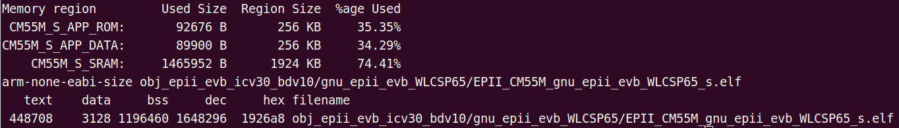
- Step 7: Generate firmware image file
    ```
    cd ../we2_image_gen_local/
    cp ../EPII_CM55M_APP_S/obj_epii_evb_icv30_bdv10/gnu_epii_evb_WLCSP65/EPII_CM55M_gnu_epii_evb_WLCSP65_s.elf input_case1_secboot/
    ./we2_local_image_gen project_case1_blp_wlcsp.json
    ```
    For Orange PI we need the docker environment. First, install QEMU for multi-architecture support. This needs to be done only once.
    ```
    sudo apt update
    sudo apt install qemu-user-static binfmt-support

    # Register QEMU with binfmt
    sudo update-binfmts --enable qemu-x86_64
    ```
    After the docker environment is configured, it can ce instantiated wiht:
    ```
    cd ..
    cd we2_image_gen_local/
    cp ../EPII_CM55M_APP_S/obj_epii_evb_icv30_bdv10/gnu_epii_evb_WLCSP65/EPII_CM55M_gnu_epii_evb_WLCSP65_s.elf input_case1_secboot/
    docker run --rm -it --platform linux/amd64 -v $(pwd):/work -w /work ubuntu:latest bash
    ```
    Within the docker environment:
    ```
    ./we2_local_image_gen project_case1_blp_wlcsp.json
    ```
    CTRL+d to leave the docker environment.
- Output firmware image: `./output_case1_sec_wlcsp/output.img`
    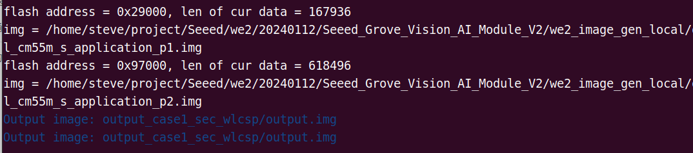

[Back to Outline](https://github.com/OliverFaust/Three-Gate-Validation-Framework?tab=readme-ov-file#outline)
## How to flash the firmware?
This part explains how you can flash the firmware to Grove Vision AI Module V2.
### System Requirement
- Driver
    - If you find that the Grove Vision AI V2 is not recognised after connecting it to your computer, you should install the driver which can reference [here](https://wiki.seeedstudio.com/grove_vision_ai_v2/#driver).
1. Grove Vision AI Module V2
2. Connection cable
    - Micro usb cable: connect to EVB (as Power/UART)
3. Software Tools
    Serial terminal emulation application
    - In the following description, `TeraTerm` and `Minicom` will be used.
        - Serial terminal emulation application Setting
            - Baud Rate 921600 bps
            - Data		8 bit
            - Parity		none
            - Stop		1 bit
            - Flow control	none
            - please check xmodem protocol is supported.
        - Minicom (for Linux PC)
            - Install minicom command
                ```
                sudo apt-get install minicom
                ```
            - Burn application to flash by using xmodem send application binary.
                - Minicom will extra install "lrzsz" package to support xmodem protocol
                    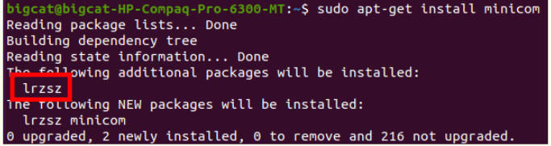
                -  If you did not have “lrzsz” instruction, please install by following instruction.
                    ```
                    sudo apt-get install lrzsz #(to support xmodem protocol)
                    ```
            - Open the permissions to access the device
                ```
                sudo setfacl -m u:[USERNAME]:rw /dev/ttyUSB0
                # in my case
                # sudo setfacl -m u:kris:rw /dev/ttyACM0
                ```
                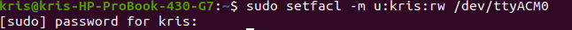
            - Open minicom
                ```
                sudo minicom -s
                ```
                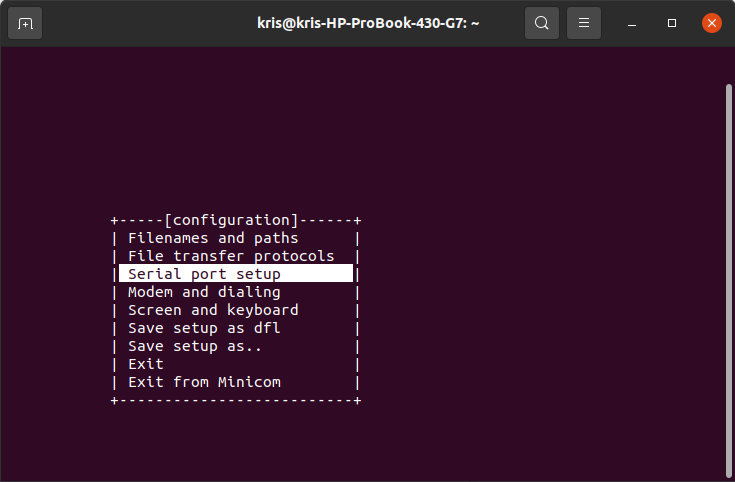
            - Setup serial port and COM Port name
                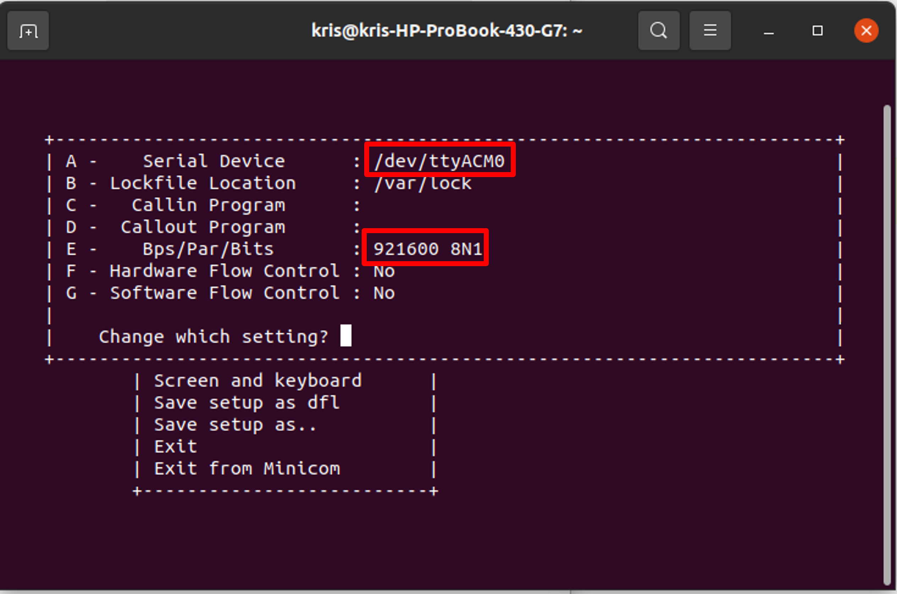
                - Tips for finding the COM Port name.
                  - You can use google chrome to connect to [Seeed SenseCraft AI](https://seeed-studio.github.io/SenseCraft-Web-Toolkit/#/setup/process), select `Grove Vision(V2)` and press `Connect`.
                    
                  - Then, you would get the COM Port name.
                    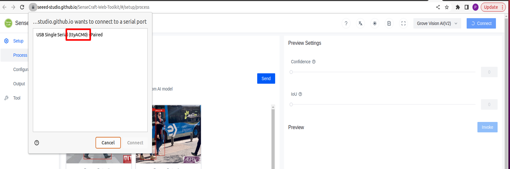
        - TeraTerm (for Windows PC)
            - Setup serial port 
                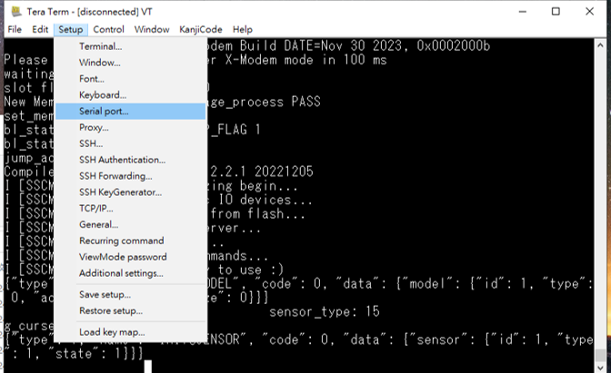
                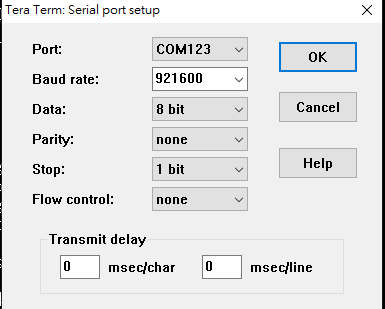

[Back to Outline](https://github.com/OliverFaust/Three-Gate-Validation-Framework?tab=readme-ov-file#outline)


### Flash Image Update at Linux Environment by python code
- Prerequisites for xmodem
    - Please install the package at [xmodem/requirements.txt](https://github.com/OliverFaust/Three-Gate-Validation-Framework/tree/main/xmodem/requirements.txt) 
        ```
        pip install -r xmodem/requirements.txt
        ```
- Disconnect `Minicom`
- Make sure your `Seeed Grove Vision AI Module V2` is connect to PC.
- Open the permissions to acceess the deivce
```
sudo setfacl -m u:[USERNAME]:rw /dev/ttyUSB0
# in my case
# sudo setfacl -m u:kris:rw /dev/ttyACM0
```

- Open `Terminal` and key-in following command
- port: the COM number of your `Seeed Grove Vision AI Module V2`, for example,`/dev/ttyACM0`
- baudrate: 921600
- file: your firmware image [maximum size is 1MB]
    ```
    python3 xmodem/xmodem_send.py --port=[your COM number] --baudrate=921600 --protocol=xmodem --file=we2_image_gen_local/output_case1_sec_wlcsp/output.img

    # example:
    # python3 xmodem/xmodem_send.py --port=/dev/ttyACM0 --baudrate=921600 --protocol=xmodem --file=we2_image_gen_local/output_case1_sec_wlcsp/output.img
    ```
- It will start to burn firmware image.
    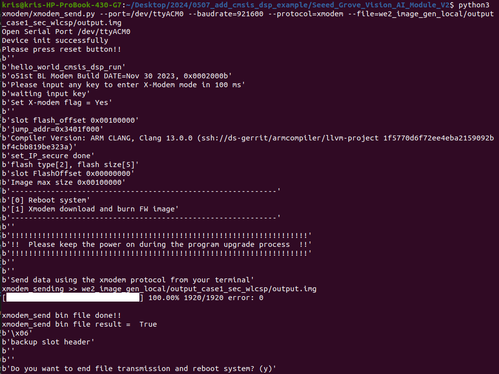
- Please press `reset` buttun on `Seeed Grove Vision AI Module V2`.
    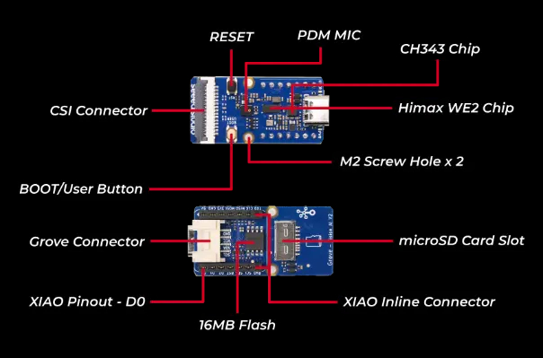
- It will success to run the algorithm.

[Back to Outline](https://github.com/OliverFaust/Three-Gate-Validation-Framework?tab=readme-ov-file#outline)
### Flash Image Update at Linux Environment
Following steps update application in the flash.
- Step 1: Open `Minicom`, setup serial port and COM Port name-> connect to Grove Vision AI Module V2. (Please reference the minicom part of [System Requirement](https://github.com/OliverFaust/Three-Gate-Validation-Framework?tab=readme-ov-file#system-requirement))
    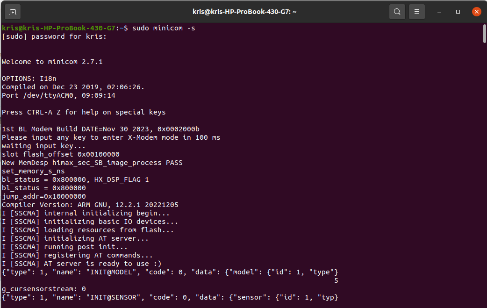
- Step 2: Hold down any key on the keyboard (except the Enter key) and press the reset button to reset Grove Vision AI Module V2 and the startup options will be displayed.
    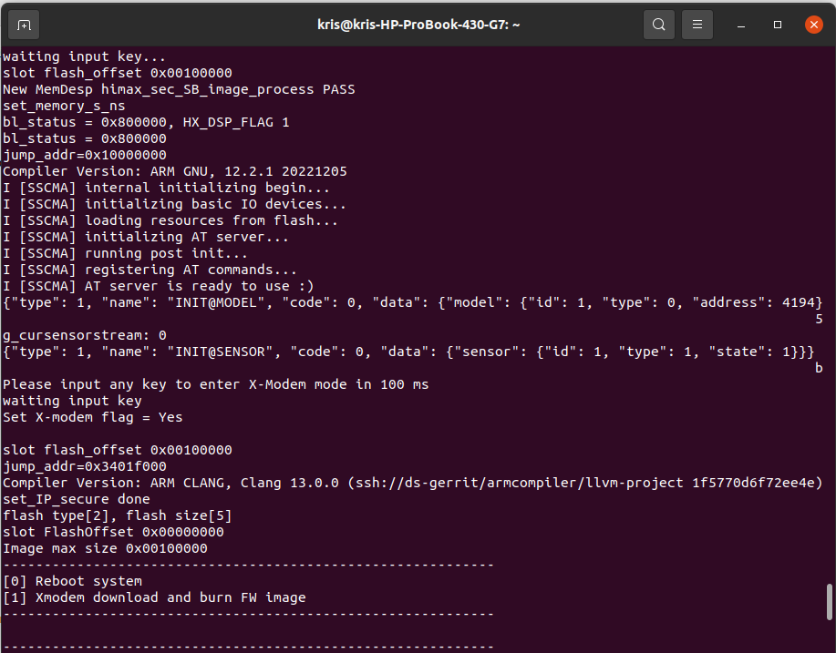
- Step 3: Press button “1” and Grove Vision AI Module V2 will enter receiving mode after then.  
    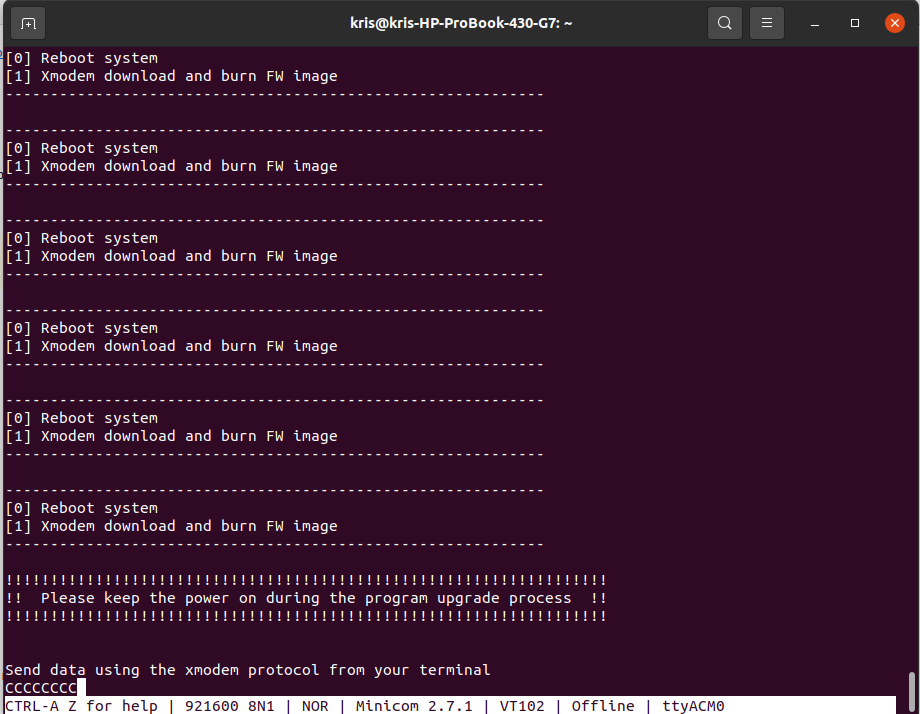
- Step 4: Press `Ctrl+A` on keyboard to enter minicom menu, and then press `s` on keyboard to upload file and select `xmodem`. 
    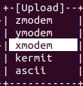
- Step 5: Select the firmware image at `Seeed_Grove_Vision_AI_Module_V2\we2_image_gen_local\output_case1_sec_wlcsp\output.img` and press `enter` to burn. 
    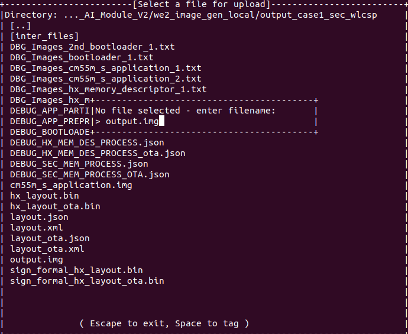
- Step 6: After burning is compelete, press any key to be continue. 
    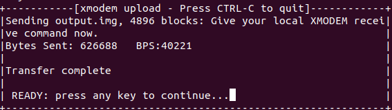
- Step 7: Then, you will see the message "Do you want to end file transmission and reboot system? (y)" is displayed. Press button `y` to restart.
    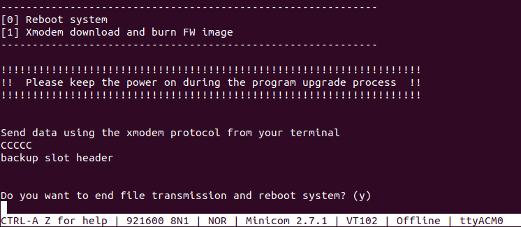
- Step 8: You will see the uart on `minicom` which is runing your algorithm.
    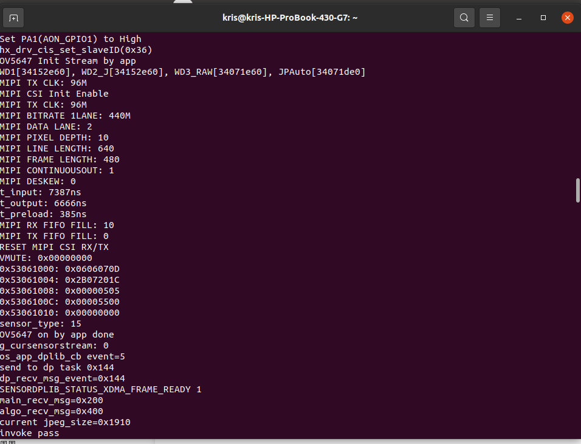

[Back to Outline](https://github.com/OliverFaust/Three-Gate-Validation-Framework?tab=readme-ov-file#outline)
### Flash using Edge Impulse CLI tools
This method works on all supported operating systems (Windows/Linux/MacOS...)

- Step 1: [Install the Edge Impulse CLI tools](https://docs.edgeimpulse.com/docs/tools/edge-impulse-cli/cli-installation)
- Step 2: Open any system terminal and run the following command
  ```
  himax-flash-tool -d WiseEye2 -f <path_to_four_firmware_img_file>
  ```
- Step 3: Wait until you see the following message:
  ```
  [HMX] Press **RESET** to start the application...
  [HMX] Firmware update completed
  ```

Note: if the flashing process hangs, just cancel it (Ctrl+C) and start once again.

[Back to Outline](#outline)

## How to restore to the original factory settings
### Linux Environment
- Update the flash image `Seeed_SenseCraft_AI*.img` to Grove Vision AI Module V2 and press `reset` buttun.
    
- Disconnect the `Minicom`:
    - Please press `Ctrl+A` on keyboard and press `z` on keyboard to go to the menu of `minicom`.
        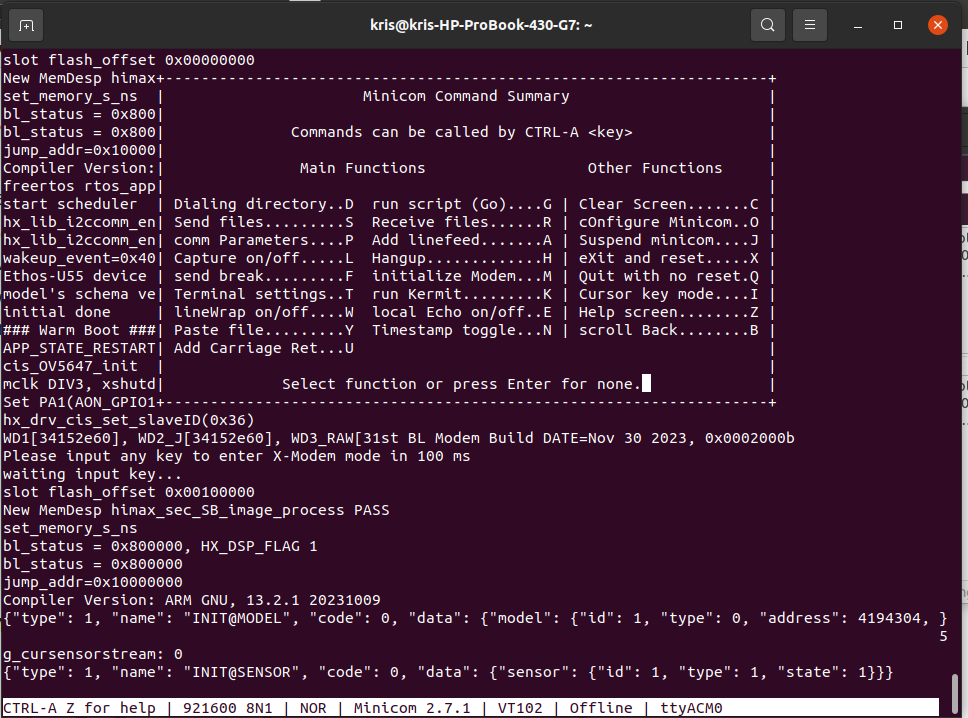
    - Then, press `q` on keyboard to quit with no reset `minicom`, and press `yes` to leave.
        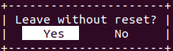

- Open the permissions to acceess the deivce
  ```
  sudo setfacl -m u:[USERNAME]:rw /dev/ttyUSB0
  # in my case
  # sudo setfacl -m u:kris:rw /dev/ttyACM0
  ```
  
- After doing the above steps, you can run the [SenseCraft AI](https://wiki.seeedstudio.com/grove_vision_ai_v2_software_support/#-no-code-getting-started-with-sensecraft-ai-) on Grove Vision AI Module V2.
  1. Introduction : https://wiki.seeedstudio.com/grove_vision_ai_v2/
  2. Connect Grove Vision AI Module to NB USB port
  3. Open "Google Chrome" browser
  4. Open [SenseCraft Homepage](https://seeed-studio.github.io/SenseCraft-Web-Toolkit/#/setup/process)
  5. Select "Grove Vision AI(WE2)" and connect (serial port)
    
    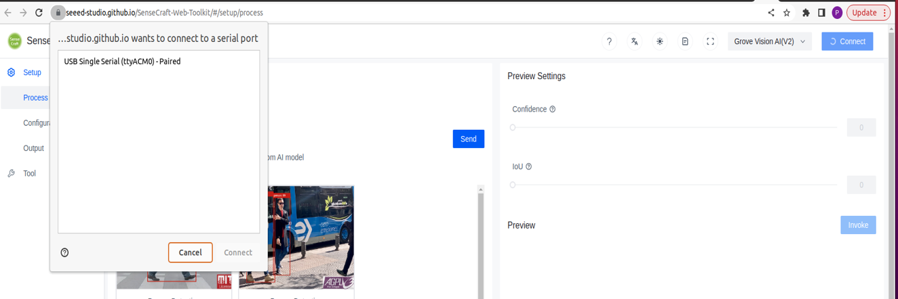
    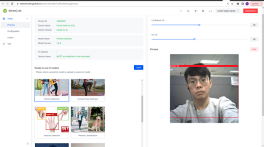

[Back to Outline](https://github.com/OliverFaust/Three-Gate-Validation-Framework?tab=readme-ov-file#outline)

## How to add support for raspberry pi camera?
You can reference the scenario app [allon_sensor_tflm](https://github.com/OliverFaust/Three-Gate-Validation-Framework/tree/main/EPII_CM55M_APP_S/app/scenario_app/allon_sensor_tflm) , [allon_sensor_tflm_freertos](https://github.com/OliverFaust/Three-Gate-Validation-Framework/tree/main/EPII_CM55M_APP_S/app/scenario_app/allon_sensor_tflm_freertos) and [tflm_fd_fm](https://github.com/OliverFaust/Three-Gate-Validation-Framework/tree/main/EPII_CM55M_APP_S/app/scenario_app/tflm_fd_fm).
Take allon_sensor_tflm for example, you should only modify the [allon_sensor_tflm.mk](https://github.com/OliverFaust/Three-Gate-Validation-Framework/blob/main/EPII_CM55M_APP_S/app/scenario_app/allon_sensor_tflm/allon_sensor_tflm.mk#L37) from cis_ov5647 to cis_imx219 or cis_imx477.
```
#CIS_SUPPORT_INAPP_MODEL = cis_ov5647
CIS_SUPPORT_INAPP_MODEL = cis_imx219
#CIS_SUPPORT_INAPP_MODEL = cis_imx477
```
So that, it can support cis_imx219 or cis_imx477 camera.

[Back to Outline](https://github.com/OliverFaust/Three-Gate-Validation-Framework?tab=readme-ov-file#outline)

## How to use CMSIS-NN at the project?
-  Modify the setting at the [makefile](https://github.com/OliverFaust/Three-Gate-Validation-Framework/blob/main/EPII_CM55M_APP_S/makefile)
    - Enable the flag `LIB_CMSIS_NN_ENALBE` to build CMSIS-NN library 
        ```
        LIB_CMSIS_NN_ENALBE = 1
        ``` 
    - You can reference the scenario app example about [allon_sensor_tflm_cmsis_nn](https://github.com/OliverFaust/Three-Gate-Validation-Framework/tree/main/EPII_CM55M_APP_S/app/scenario_app/allon_sensor_tflm_cmsis_nn) which is the example running the model without passing vela and using the CMSIS-NN library.
        - Change the `APP_TYPE` to `allon_sensor_tflm_cmsis_nn` at the [makefile](https://github.com/OliverFaust/Three-Gate-Validation-Framework/blob/main/EPII_CM55M_APP_S/makefile)
            ```
            APP_TYPE = allon_sensor_tflm_cmsis_nn
            ```

[Back to Outline](https://github.com/OliverFaust/Three-Gate-Validation-Framework?tab=readme-ov-file#outline)
